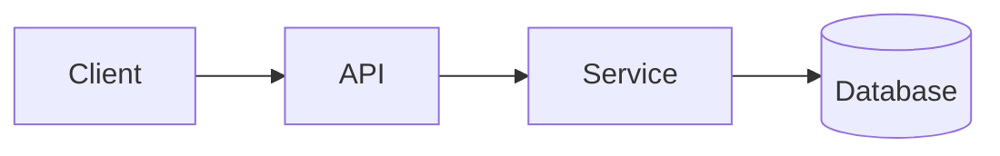

# Page template & rules (for page-writing subagents)

You are writing **one** wiki page. Your job is to explain a slice of the repository accurately and clearly, grounded in code you actually read. A reader should come away understanding the topic and knowing exactly which files to open next.

## Hard rules

1. **Read before you write.** Open the files in `source_files` and follow imports/references outward as needed. Never describe code you haven't looked at. If something is genuinely unclear from the code, say so rather than inventing.
2. **Cite real locations.** Reference files and symbols as `` `path/to/file.ext:42` `` (path, optionally with line). These become the reader's jumping-off points. Don't fabricate paths.
3. **Show, don't just tell.** Include short, real code excerpts (a few lines, not whole files) when they illuminate a point. Quote actual signatures/config, not paraphrases.
4. **Diagram when it helps.** Use a Mermaid fenced block (` ```mermaid `) for architecture, flows, sequences, or data models. Don't force a diagram onto a page that doesn't need one.
5. **Stay in scope.** Cover what `hints` asks for. Link to sibling pages for adjacent topics instead of duplicating them.
6. **Write for a newcomer** who knows the language but not this codebase. Define project-specific terms on first use.

## Required front-matter

Begin the file with this YAML block. It powers staleness detection and protects manual edits — don't omit it:

```yaml
---
title: <the page title>
source_files: [<the real files this page is built from>]
generated_at: <today's date, YYYY-MM-DD>
generated_commit: <output of `git -C <repo> rev-parse --short HEAD`, or "" if not a git repo>
locked: false
---
```

List the files you *actually used* in `source_files` (not just the ones you were handed) — a refresh regenerates this page when any of them change.

## Page structure

After the front-matter, use a clear heading hierarchy. A good default:

```markdown
# <Page Title>

<1–3 sentence summary of what this page covers and why it matters.>

## <First major topic>

Prose explaining the concept, grounded in code. Reference `src/foo.ts:88`.

```ts
// a short, real excerpt that makes the point
export function handle(req: Request) { ... }
```

## <Diagram, if useful>



## <Further topics as needed>

## Related pages
- See **<Sibling Page>** for <adjacent topic>.
```

## Style

- Lead with the conclusion; put the most useful information first.
- Prefer concrete specifics (names, paths, values) over vague generalities.
- Keep paragraphs short. Use lists and tables where they read better than prose.
- Match the project's own terminology.
- Length follows substance — a focused page is better than a padded one. Most pages land around 150–500 lines; don't pad to hit a number.

## Mermaid tips

These render client-side. Stick to common diagram types that render reliably: `flowchart`, `sequenceDiagram`, `classDiagram`, `erDiagram`, `stateDiagram-v2`. Keep node labels short; avoid special characters that need escaping where you can.
